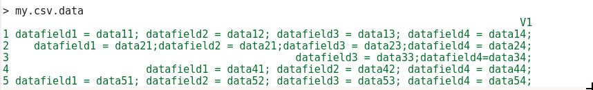
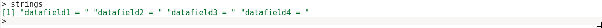
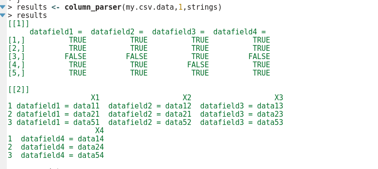

# Column Parser

This column parser takes a delimited file with unaligned columns and produces an output where the desired columns are all parsed out. 

All your data has to be in one column like this:

You have to import your data to R with:
'stringsAsFactors = False'

You have to specify which data you want from your file. Pass this as "strings":

The output is a list of 2. 
The first list element contains a TRUE/FALSE table indicating which rows met your criteria. 
The second list element will only have rows where "strings" criteria are met. It will also only generate an output for those rows.

The use-case for the parser was for SWIFT payment transactions data where not all payment types contain all fields. 
This is a more generalized version of the parser and it works on most datasets with unaligned columns.
The final output can be further refined, but this was enough for purposes it was built for as the rest could be handled in e.g. Excel. 
